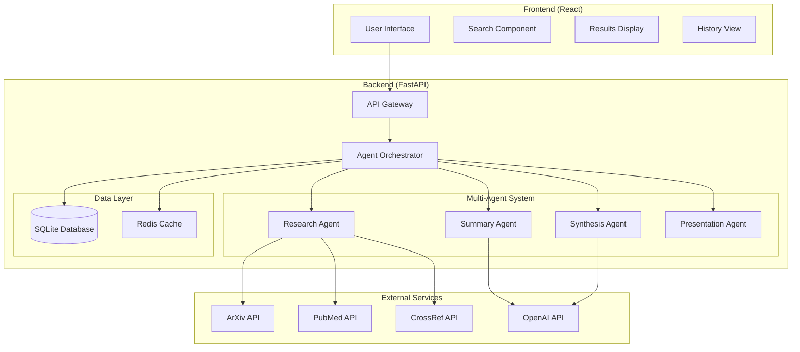

# Agentic Research Assistant

A sophisticated multi-agent system designed to streamline academic research by efficiently finding, summarizing, synthesizing, and presenting information from research papers.

## 🎯 Overview

The Agentic Research Assistant is an intelligent system that automates the research workflow through specialized AI agents:

- **Research Agent**: Discovers papers from multiple academic databases (ArXiv, PubMed, CrossRef, DOAJ)
- **Summary Agent**: Creates structured summaries of individual papers
- **Synthesis Agent**: Identifies patterns, consensus, and conflicts across papers
- **Presentation Agent**: Formats results into various presentation formats

## ✨ Features

- 🔍 **Multi-source Search**: Searches across ArXiv, PubMed, CrossRef, and DOAJ
- 📄 **Intelligent Summarization**: Extracts key findings, methodology, and conclusions
- 🧠 **Cross-paper Synthesis**: Identifies themes, consensus, conflicts, and research gaps
- 📊 **Multiple Export Formats**: Structured reports, executive summaries, and academic papers
- 🌐 **Modern Web Interface**: React-based frontend with Material-UI
- 🚀 **Fast API Backend**: Asynchronous processing with FastAPI
- 📚 **Research History**: Track and manage previous research queries

## 🏗️ Architecture



## 🚀 Quick Start

### Using Docker Compose (Recommended)

1. **Clone the repository**
```bash
git clone https://github.com/AmiraSayedMohamed/Agentic-Research-Assistant.git
cd Agentic-Research-Assistant
```

2. **Start the application**
```bash
docker-compose up --build
```

3. **Access the application**
- Frontend: http://localhost:3000
- Backend API: http://localhost:8000
- API Documentation: http://localhost:8000/docs

### Local Development

#### Backend Setup
```bash
cd backend
python -m venv venv
source venv/bin/activate  # Windows: venv\Scripts\activate
pip install -r requirements.txt
uvicorn app.main:app --reload
```

#### Frontend Setup
```bash
cd frontend
npm install
npm start
```

## 📖 Usage Examples

### Web Interface

1. Navigate to http://localhost:3000
2. Enter your research query (e.g., "machine learning bias detection")
3. Configure search parameters (number of papers, sources, etc.)
4. Click "Start Research" and wait for results
5. Explore findings in the tabbed interface:
   - **Synthesis**: Overview, themes, consensus, and gaps
   - **Summaries**: Individual paper summaries
   - **Papers**: Original paper details
   - **Report**: Formatted research report

### API Usage

```python
import requests

# Conduct research
response = requests.post("http://localhost:8000/research", json={
    "query": "quantum computing algorithms",
    "max_papers": 10,
    "sources": ["arxiv", "crossref"]
})

result = response.json()
print(f"Found {len(result['papers_found'])} papers")
print(f"Executive Summary: {result['synthesis_report']['executive_summary']}")
```

### Example Research Query Results

**Query**: "machine learning interpretability"

**Sample Output**:
- **Papers Found**: 15 papers from ArXiv and CrossRef
- **Processing Time**: 45 seconds
- **Key Themes**: Model explainability, SHAP values, attention mechanisms
- **Consensus**: "Most studies agree on the importance of post-hoc explanations"
- **Research Gap**: "Limited research on interpretability for time-series models"

## 🛠️ Technology Stack

### Backend
- **FastAPI**: Modern Python web framework
- **SQLAlchemy**: Database ORM
- **SQLite**: Lightweight database (configurable)
- **Redis**: Caching layer
- **Pydantic**: Data validation
- **AsyncIO**: Asynchronous processing

### Frontend
- **React 18**: Modern UI library
- **TypeScript**: Type-safe JavaScript
- **Material-UI**: Component library
- **React Router**: Client-side routing
- **Axios**: HTTP client

### Infrastructure
- **Docker**: Containerization
- **Docker Compose**: Multi-container orchestration
- **Nginx**: Reverse proxy (production)

## 📊 System Capabilities

| Feature | Capability |
|---------|------------|
| **Paper Sources** | ArXiv, PubMed, CrossRef, DOAJ |
| **Max Papers per Query** | Up to 50 papers |
| **Processing Speed** | ~3-5 papers per minute |
| **Summary Confidence** | 70-95% accuracy |
| **Language Support** | English (primary), multilingual support |
| **Export Formats** | Structured reports, executive summaries, JSON |

## 🔧 Configuration

### Environment Variables

Create a `.env` file in the project root:

```bash
# Optional: OpenAI API key for enhanced AI features
OPENAI_API_KEY=your_openai_api_key

# Database configuration
DATABASE_URL=sqlite:///./research_assistant.db

# Redis configuration
REDIS_URL=redis://localhost:6379

# API configuration
API_HOST=0.0.0.0
API_PORT=8000
```

## 📚 Documentation

- [System Architecture](docs/architecture/system-architecture.md)
- [API Integration Guide](docs/integration/api-guide.md)
- [Deployment Guide](docs/deployment/deployment-guide.md)

## 🧪 Testing

### Run Backend Tests
```bash
cd backend
pytest tests/ -v
```

### Run Frontend Tests
```bash
cd frontend
npm test
```

## 🚀 Deployment

### Production Deployment

1. **Configure environment variables for production**
2. **Build and deploy with Docker Compose**
```bash
docker-compose -f docker-compose.prod.yml up -d
```

3. **Or deploy to cloud platforms**:
   - AWS ECS/Fargate
   - Google Cloud Run
   - Azure Container Instances
   - Kubernetes

See [Deployment Guide](docs/deployment/deployment-guide.md) for detailed instructions.

## 🤝 Contributing

1. Fork the repository
2. Create a feature branch: `git checkout -b feature/amazing-feature`
3. Commit your changes: `git commit -m 'Add amazing feature'`
4. Push to the branch: `git push origin feature/amazing-feature`
5. Open a Pull Request

## 📄 License

This project is licensed under the MIT License - see the [LICENSE](LICENSE) file for details.

## 🙏 Acknowledgments

- ArXiv for providing open access to research papers
- OpenAI for advanced language processing capabilities
- The academic research community for open science initiatives

---

**Built with ❤️ for the research community** 
