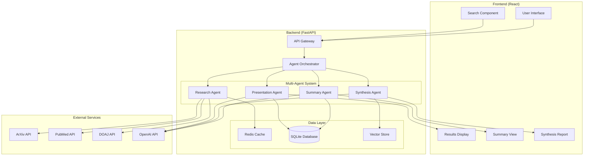

# Agentic Research Assistant - System Architecture

## Overview

The Agentic Research Assistant is a multi-agent system designed to streamline academic research by efficiently finding, summarizing, synthesizing, and presenting information from research papers.

## Architecture Diagram

## Agent Specifications

### 1. Research Agent
**Purpose**: Discover and retrieve academic papers from multiple sources

**Capabilities**:
- Search ArXiv, PubMed, DOAJ, and other academic databases
- Filter papers by date, relevance, citation count
- Extract paper metadata (title, authors, abstract, DOI)
- Rank papers by relevance to query

**Input**: Research query, search parameters
**Output**: List of relevant papers with metadata

### 2. Summary Agent
**Purpose**: Create concise, structured summaries of individual papers

**Capabilities**:
- Extract key findings and methodology
- Identify main contributions and limitations
- Generate structured summaries (objective, methods, results, conclusions)
- Maintain citation information

**Input**: Paper content (PDF/text)
**Output**: Structured summary with key insights

### 3. Synthesis Agent
**Purpose**: Combine information across multiple papers to identify patterns and gaps

**Capabilities**:
- Compare findings across papers
- Identify consensus and contradictions
- Detect research gaps and trends
- Generate thematic analysis

**Input**: Collection of paper summaries
**Output**: Cross-paper synthesis report

### 4. Presentation Agent
**Purpose**: Format and present research findings in various formats

**Capabilities**:
- Generate executive summaries
- Create structured reports
- Format citations and references
- Export to multiple formats (PDF, HTML, Markdown)

**Input**: Research results and synthesis
**Output**: Formatted presentation ready for use

## Data Flow

1. **Query Processing**: User submits research query through frontend
2. **Research Phase**: Research Agent searches multiple databases
3. **Summarization Phase**: Summary Agent processes retrieved papers
4. **Synthesis Phase**: Synthesis Agent analyzes patterns across summaries
5. **Presentation Phase**: Presentation Agent formats final output
6. **Result Display**: Frontend displays structured results to user

## Technology Stack

### Backend
- **Framework**: FastAPI (Python)
- **AI/ML**: OpenAI GPT models, LangChain, Sentence Transformers
- **Database**: SQLite with SQLAlchemy ORM
- **Caching**: Redis for API response caching
- **Vector Store**: FAISS for semantic search
- **Async Processing**: AsyncIO for concurrent operations

### Frontend
- **Framework**: React 18 with TypeScript
- **State Management**: React Context API
- **UI Components**: Material-UI
- **HTTP Client**: Axios
- **Routing**: React Router

### Infrastructure
- **Containerization**: Docker and Docker Compose
- **API Documentation**: FastAPI automatic OpenAPI docs
- **Testing**: Pytest for backend, Jest for frontend

## Security Considerations

- API key management through environment variables
- Rate limiting on external API calls
- Input validation and sanitization
- CORS configuration for frontend-backend communication
- Secure handling of research data and user queries

## Scalability Features

- Async processing for concurrent paper processing
- Caching layer to reduce API calls and processing time
- Modular agent architecture for easy scaling
- Database optimization for fast query retrieval
- Vector indexing for efficient semantic search